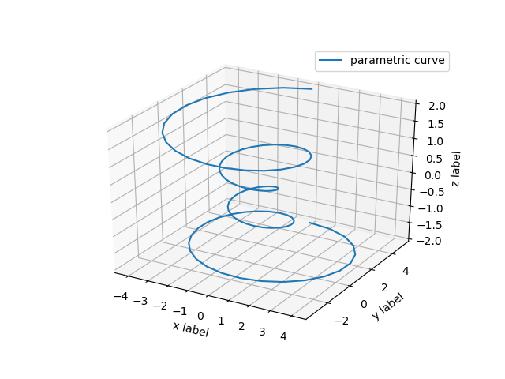
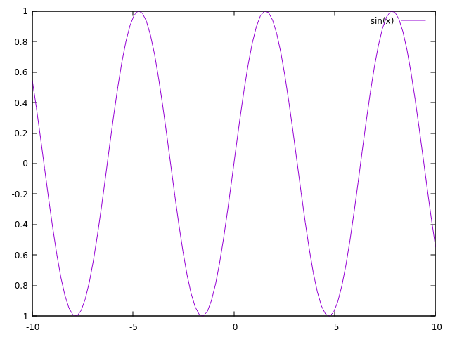
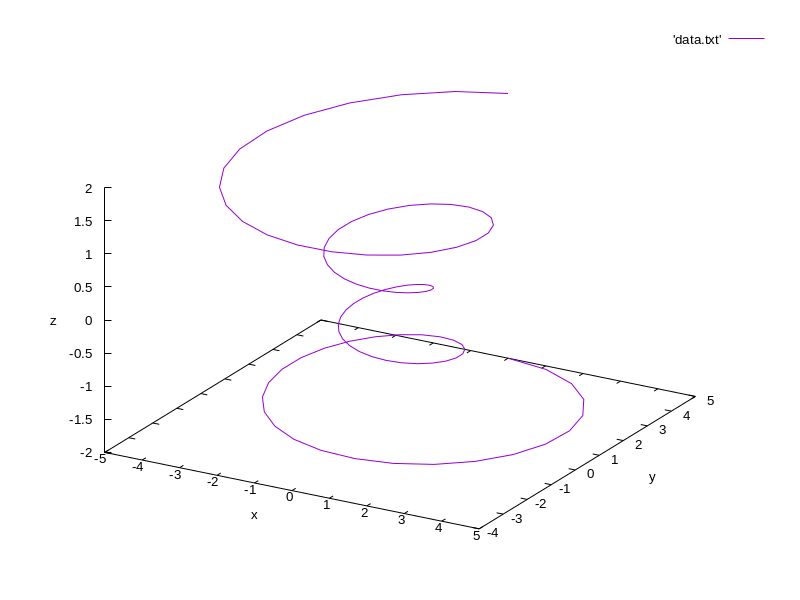
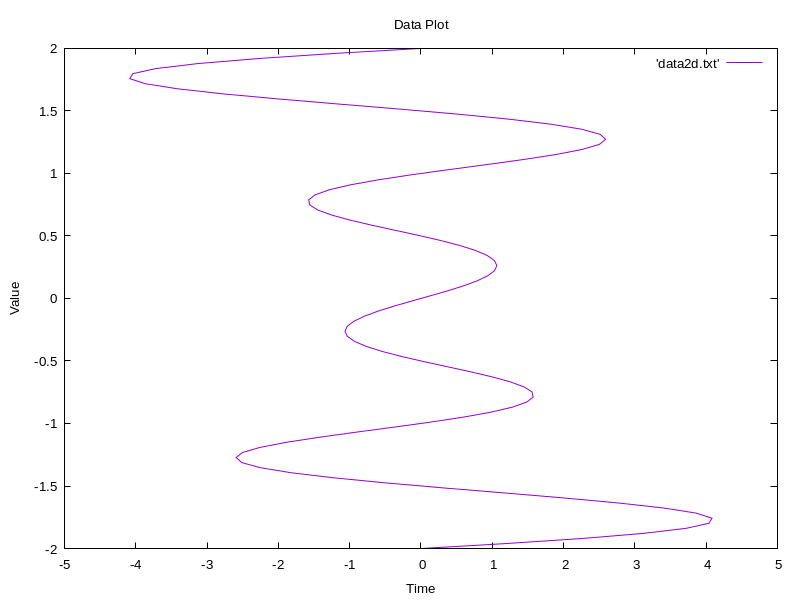

# 对 C++ 绘图方式的探索

> 全部代码见 [github](https://github.com/Alexbeast-CN/Plotcpp)

## 1. Matplotlib-cpp

Matplotlib-cpp 是 lava 大神对 Python 的 matplotlib 库做的 C++ 的封装，接口与 python 版本的类似。

### 1.1 安装

```bash
git clone https://github.com/lava/matplotlib-cpp.git
cd matplotlib-cpp
mkdir build
cd build
cmake ..
make
sudo make install
```

### 1.2 CMake 配置

CMake 中需要配置的是 `Matplotlib-cpp` 所依赖的 `python.h` 和 `numpy.h`。所以其 `CMakeLists.txt` 的最小内容为：

```python
cmake_minimum_required ( VERSION 3.10 )
project (testprj)

set(CMAKE_CXX_STANDARD 17)

find_package(Python3 COMPONENTS Interpreter Development)
add_definitions(-DWITHOUT_NUMPY)

if ( ${Python3_FOUND} )
    #include_directories(${Python3_INCLUDE_DIRS})
else()
    message ( FATAL_ERROR "Python3 not found, please install it." )
endif()

include_directories (${Python3_INCLUDE_DIRS})

add_executable ( ${PROJECT_NAME} main.cpp)

target_link_libraries( ${PROJECT_NAME} 
    PRIVATE 
    ${Python3_LIBRARIES}
)
```

> 比较正规的写法请看[知乎|CMake+matplotlib-cpp+Basic example简单测试](https://zhuanlan.zhihu.com/p/527826169) 

### 1.3 使用

将 `matplotlib-cpp` 的 `matplotlibcpp.h` 文件加入到项目中，然后在项目中引入头文件：


```cpp
#define _USE_MATH_DEFINES
#include "matplotlibcpp.h"
#include <cmath>

namespace plt = matplotlibcpp;

int main()
{
    std::vector<double> x, y, z;
    double theta, r;
    double z_inc = 4.0/99.0; double theta_inc = (8.0 * M_PI)/99.0;
    
    for (double i = 0; i < 100; i += 1) {
        theta = -4.0 * M_PI + theta_inc*i;
        z.push_back(-2.0 + z_inc*i);
        r = z[i]*z[i] + 1;
        x.push_back(r * sin(theta));
        y.push_back(r * cos(theta));
    }

    std::map<std::string, std::string> keywords;
    keywords.insert(std::pair<std::string, std::string>("label", "parametric curve") );

    plt::plot3(x, y, z, keywords);
    plt::xlabel("x label");
    plt::ylabel("y label");
    plt::set_zlabel("z label"); // set_zlabel rather than just zlabel, in accordance with the Axes3D method
    plt::legend();
    plt::show();
}
```



## 2. gnuplot

gnuplot 是 gnu 计划中的一个开源软件，用于绘制二维和三维图形。它的语法与 matlab 类似，但是更加简洁。虽然 gnuplot 有 C++ 接口 [gnuplot](https://github.com/dstahlke/gnuplot-iostream)，但配置起来比较麻烦。所以下面是直接使用命令行绘图。

### 2.1 安装

```bash
sudo apt install gnuplot
```

### 2.2 使用

直接在命令行中使用 `gnuplot` 命令即可进入交互式绘图界面，输入 `plot sin(x)` 即可绘制出 `sin(x)` 函数图像。



在 c++ 中则需要将数据写入到文件中，然后使用 `gnuplot` 命令绘制。

为了省事，可以将 gnuplot 的命令写成一个脚本文件，然后在 c++ 中调用。如上面所使用的 3d 绘图：

```bash
#!/bin/bash

# Set the data file name and output file name
DATA_FILE=data.txt
OUTPUT_FILE=output.png

# Use gnuplot to plot the data
gnuplot <<- EOF
set terminal pngcairo enhanced font "arial,10" fontscale 1.0 size 800, 600
set output '$OUTPUT_FILE'
set xlabel 'x'
set ylabel 'y'
set zlabel 'z'
set ticslevel 0
set view 60,30,1,1
set pm3d depthorder hidden3d 2
set palette rgbformulae 22,13,-31
splot '$DATA_FILE' with lines
EOF
```

```cpp
#define _USE_MATH_DEFINES
#include <cmath>
#include <fstream>
#include <stdlib.h>

using namespace std;

int main(){

    ofstream outFile;
    outFile.open("data.txt");
    outFile << "# x y z" << endl;
    double theta, r;
    double z_inc = 4.0/99.0; double theta_inc = (8.0 * M_PI)/99.0;
    
    for (double i = 0; i < 100; i += 1) {
        theta = -4.0 * M_PI + theta_inc*i;
        float z = -2.0 + z_inc*i;
        r = z*z + 1;
        float x = r * sin(theta);
        float y = r * cos(theta);

        outFile << x << " " << y << " " << z << endl;
    }
    outFile.close();

    // call the gnuplot script
    std::string res;
	res = system("bash ../plot3d.sh");

    return 0;
}
```

> 上面的程序输出的图像位于 `build` 目录




常用的 2d 绘图脚本：

```bash
#!/bin/bash

# Set the data file name and output file name
DATA_FILE=data.txt
OUTPUT_FILE=output.png
X_LABEL="x"
Y_LABEL="y"
TITLE="Data Plot"

# Use gnuplot to plot the data
gnuplot <<- EOF
set terminal pngcairo enhanced font "arial,10" fontscale 1.0 size 800, 600
set output '$OUTPUT_FILE'
set xlabel '$X_LABEL'
set ylabel '$Y_LABEL'
set title '$TITLE'
plot '$DATA_FILE' with lines
EOF
```


